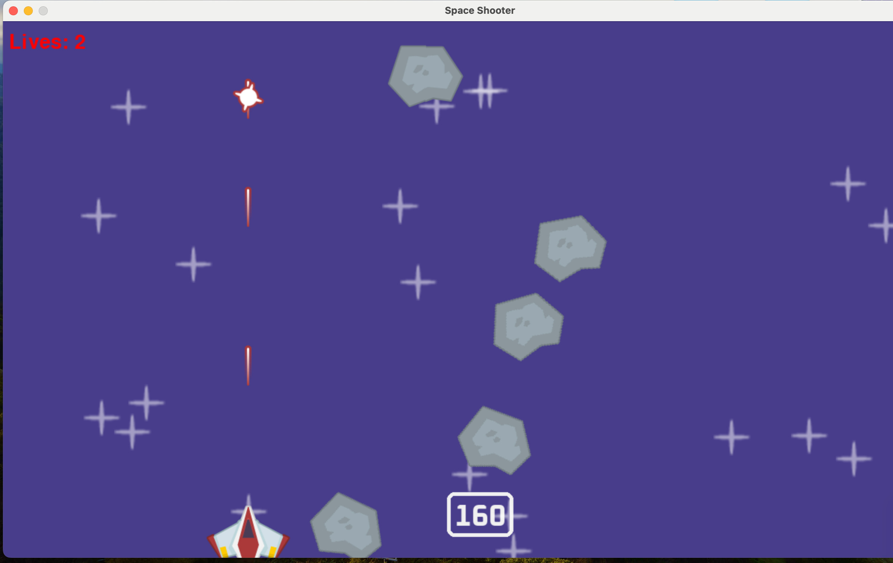

# SPACESHIP GAME 🚀🚀☄️☄️




## 🎮 How to Play

<details>
<summary><strong>🪟 Windows</strong></summary>

```sh
# Clone the repository
git clone https://github.com/saksham-2000/spaceship-game.git
cd spaceship-game

# Create virtual environment
python -m venv venv

# Activate virtual environment
venv\Scripts\activate

# Install dependencies
pip install -r requirements.txt

# Run the game
python main.py
```
</details> 

<details> <summary><strong>🍏 macOS</strong></summary>

```sh
# Clone the repository
git clone https://github.com/saksham-2000/spaceship-game.git
cd spaceship-game

# Create virtual environment
python3 -m venv venv

# Activate virtual environment
source venv/bin/activate


# Install dependencies
pip install -r requirements.txt

# Run the game
python main.py
```
</details> 

<details> <summary><strong>🐧 Linux</strong></summary>

```sh
# Install system dependencies (Ubuntu/Debian)
sudo apt update
sudo apt install python3 python3-venv python3-pip git

# Clone the repository
git clone https://github.com/saksham-2000/spaceship-game.git
cd spaceship-game

# Create virtual environment
python3 -m venv venv

# Activate virtual environment
source venv/bin/activate


# Install dependencies
pip install -r requirements.txt

# Run the game
python main.py
```
</details> 


## TODO (NOW):

- BETTER BACKGROUND
- IMPROVE LIFELINE ANIMATION (REPLACE WITH HEARTS)
- REFACTOR UI
- ADD SPACESHIP COLLSION (WITH METEOR) SOUND
- ADD INTRO AND OUTRO


## TODO (FUTURE):
- ADD LEVELS
- IMPLEMENT SPACESHIP WEAKENING ANIMATION WHEN IT COLLIDES WITH A METEOR

 
  
